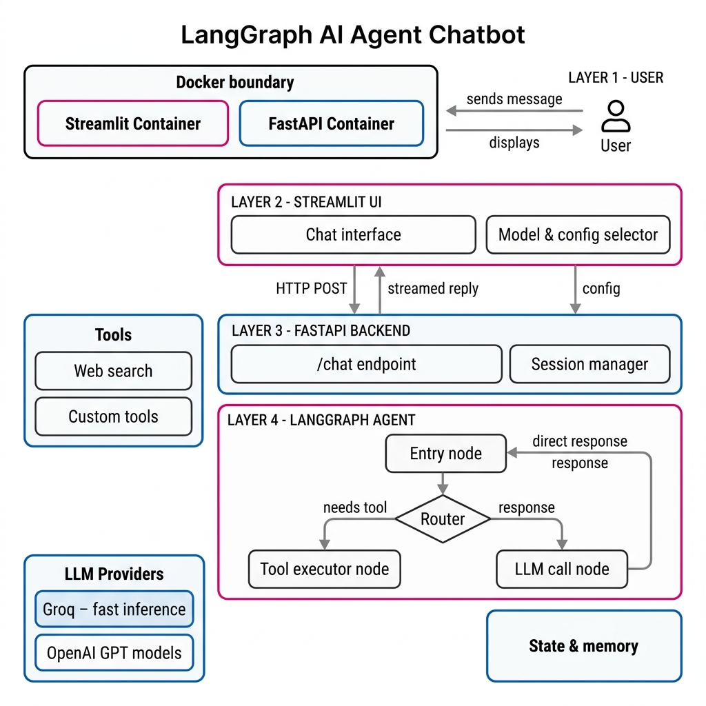

# LangGraph AI Agent Chatbot

> **A production-ready, multi-provider AI agent** built with LangGraph, FastAPI, and Streamlit — containerised with Docker and deployable to Azure Container Apps in minutes.

---

## Table of Contents

- [Project Overview](#-project-overview)
- [Architecture](#-architecture)
- [Tech Stack](#-tech-stack)
- [Features](#-features)
- [Project Structure](#-project-structure)
- [Quick Start](#-quick-start)
  - [Prerequisites](#prerequisites)
  - [Environment Variables](#environment-variables)
  - [Run with Docker Compose (Recommended)](#run-with-docker-compose-recommended)
  - [Run without Docker (Pipenv)](#run-without-docker-pipenv)
- [API Reference](#-api-reference)
- [Deployment — Azure Container Apps](#-deployment--azure-container-apps)
- [Configuration Guide](#-configuration-guide)
- [Security Notes](#-security-notes)
- [Troubleshooting](#-troubleshooting)

---

## 🌐 Project Overview

The **LangGraph AI Agent Chatbot** is a full-stack conversational AI application that connects a Streamlit chat UI to a FastAPI backend powered by a stateful **LangGraph ReAct agent**. The agent dynamically selects between **Groq** (blazing-fast inference via Llama 3) and **OpenAI GPT** models, and can optionally invoke **Tavily web search** as a real-time tool — all configurable at runtime without restarting any service.

### What makes it different?

| Feature | Detail |
|---|---|
| **Multi-provider LLM routing** | Switch between Groq Llama 3.3-70B, Llama 3.1-8B, or GPT-4o-mini at chat time |
| **Agentic tool use** | ReAct loop: the agent decides *when* to call web search vs. answer directly |
| **Session-aware backend** | Per-session state managed server-side via the Session Manager |
| **Streaming-ready UI** | Streamlit chat interface with animated "Generating…" indicator |
| **Containerised & cloud-ready** | Two Docker images — frontend & backend — orchestrated with Docker Compose |
| **Zero-lock-in deployment** | Ships to Azure Container Apps, AWS ECS, or any container runtime |

---

## 🏗️ Architecture

The system is composed of four logical layers, all running inside Docker:



### Layer-by-Layer Breakdown

```
┌─────────────────────────────────────────────────────────────────┐
│  Docker                                                          │
│  ┌───────────────────────┐   ┌──────────────────────────────┐   │
│  │  Streamlit Container  │   │     FastAPI Container        │   │
│  └───────────────────────┘   └──────────────────────────────┘   │
└─────────────────────────────────────────────────────────────────┘
```

| Layer | Component | Responsibility |
|---|---|---|
| **1 — Presentation** | Streamlit UI | Chat interface + Model & config selector sidebar |
| **2 — API Gateway** | FastAPI `/chat` endpoint | Schema validation (Pydantic), provider allow-list, error handling |
| **3 — Session** | Session Manager | Maintains per-user conversation context |
| **4 — Agent** | LangGraph ReAct Agent | Entry node → Router → Tool executor or LLM call node → State & memory |
| **Tools** | Tavily Search | Real-time web search (optional, toggle in UI) |
| **LLM Providers** | Groq / OpenAI | Model inference — selected dynamically per request |


## 🛠️ Tech Stack

| Layer | Technology | Version |
|---|---|---|
| **Agent Framework** | [LangGraph](https://github.com/langchain-ai/langgraph) | `0.2+` |
| **LLM Abstraction** | LangChain Core / Groq / OpenAI | latest |
| **Backend API** | [FastAPI](https://fastapi.tiangolo.com/) + Uvicorn | `0.115+` |
| **Frontend UI** | [Streamlit](https://streamlit.io/) | `1.40+` |
| **Web Search Tool** | [Tavily](https://tavily.com/) via `langchain-community` | latest |
| **Schema Validation** | Pydantic v2 | `2.x` |
| **Containerisation** | Docker + Docker Compose | `v2` |
| **Package Manager** | Pipenv | `2024+` |
| **Cloud Deploy** | Azure Container Apps + ACR | — |
| **Language** | Python | `3.11` |

---

##  Features

-  **ReAct Agent Loop** — Reason → Act → Observe cycle via LangGraph's `create_react_agent`
-  **Dynamic Model Selection** — Choose provider and model from the Streamlit sidebar without restarts
-  **Optional Web Search** — Toggle Tavily search on/off per conversation
-  **Persistent Chat History** — Full session history displayed in the chat UI (server session-aware)
-  **Custom System Prompts** — Editable system prompt to change the agent's personality/role at runtime
- **Provider Allow-list** — Backend enforces a whitelist of allowed models/providers
- **Fully Containerised** — Separate Dockerfiles for frontend and backend, composed together
- **Azure-Ready** — Step-by-step deployment guide for Azure Container Apps

---

## 📁 Project Structure

```
AI Agent Chatbot/
│
├── ai_agent.py           # LangGraph ReAct agent — model routing, tool binding, inference
├── backend.py            # FastAPI app — /chat endpoint, Pydantic schema, session manager
├── frontend.py           # Streamlit UI — chat interface, sidebar config, API client
│
├── Dockerfile.backend    # Backend Docker image (Python 3.11 + Uvicorn)
├── Dockerfile.frontend   # Frontend Docker image (Python 3.11 + Streamlit)
├── docker-compose.yml    # Orchestrates both containers with env var injection
│
├── Pipfile               # Pipenv dependency manifest
├── Pipfile.lock          # Locked dependency graph
├── .env.example          # Template — copy to .env and fill in your keys
├── .env                  # ⚠️ NOT committed — your real API keys live here
├── .gitignore            # Excludes .env, __pycache__, etc.
├── .dockerignore         # Excludes local files from Docker build context
│
└── assets/
    └── architecture.png  # System architecture diagram
```

---

##  Quick Start

### Prerequisites

- **Docker Desktop** ≥ 4.x + Docker Compose v2 *(recommended)*  
  — OR — **Python 3.11** + **Pipenv** for bare-metal dev
- API keys for the providers you want to use:

| Key | Required? | Get it at |
|---|---|---|
| `GROQ_API_KEY` | For Groq models | [console.groq.com](https://console.groq.com) |
| `OPENAI_API_KEY` | For GPT-4o-mini | [platform.openai.com](https://platform.openai.com) |
| `TAVILY_API_KEY` | Only if web search enabled | [tavily.com](https://tavily.com) |

---

### Environment Variables

Copy the example file and fill in your keys:

```bash
cp .env.example .env
```

`.env.example`:

```env
GROQ_API_KEY=gsk_...
OPENAI_API_KEY=sk-...
TAVILY_API_KEY=tvly-...
```

> ⚠️ **Never commit `.env`** — it is listed in `.gitignore`. Only commit `.env.example`.

---

### Run with Docker Compose (Recommended)

**1. Export your API keys** (or place them in `.env`):

```bash
export GROQ_API_KEY="gsk_..."
export OPENAI_API_KEY="sk-..."
export TAVILY_API_KEY="tvly-..."
```

**2. Build and start both services:**

```bash
docker compose up --build
```

**3. Open in your browser:**

| Service | URL |
|---|---|
| 💬 Streamlit Chat UI | [http://localhost:8501](http://localhost:8501) |
| 📄 FastAPI Swagger Docs | [http://localhost:9999/docs](http://localhost:9999/docs) |

**To stop:**

```bash
docker compose down
```

---

### Run Containers Separately (Advanced)

**Backend:**

```bash
docker build -f Dockerfile.backend -t ai-agent-backend .
docker run --rm -p 9999:9999 \
  -e GROQ_API_KEY="$GROQ_API_KEY" \
  -e OPENAI_API_KEY="$OPENAI_API_KEY" \
  -e TAVILY_API_KEY="$TAVILY_API_KEY" \
  ai-agent-backend
```

**Frontend** (point it at the running backend):

```bash
docker build -f Dockerfile.frontend -t ai-agent-frontend .
docker run --rm -p 8501:8501 \
  -e API_URL="http://host.docker.internal:9999/chat" \
  ai-agent-frontend
```

---

### Run without Docker (Pipenv)

```bash
# Install dependencies
pipenv install

# Activate virtual environment
pipenv shell

# Start backend (terminal 1)
python backend.py

# Start frontend (terminal 2)
streamlit run frontend.py
```

---

## 📡 API Reference

### `POST /chat`

Chat with the AI agent.

**Request Body:**

```json
{
  "model_name": "llama-3.3-70b-versatile",
  "model_provider": "Groq",
  "system_prompt": "Act as an AI chatbot who is smart and friendly",
  "messages": ["What is the capital of France?"],
  "allow_search": false
}
```

| Field | Type | Allowed Values |
|---|---|---|
| `model_name` | `string` | `llama-3.3-70b-versatile`, `llama-3.1-8b-instant` (Groq) · `gpt-4o-mini` (OpenAI) |
| `model_provider` | `string` | `"Groq"` or `"OpenAI"` |
| `system_prompt` | `string` | Any string defining agent behaviour |
| `messages` | `string[]` | Non-empty list of user messages |
| `allow_search` | `boolean` | `true` to enable Tavily web search tool |

**Success Response (`200`):**

```json
{
  "response": "The capital of France is Paris."
}
```

**Error Responses:**

| Code | Reason |
|---|---|
| `400` | Invalid provider, model name, or empty messages |
| `500` | Internal agent error (upstream API failure, etc.) |

**Interactive docs:** visit `http://localhost:9999/docs` (Swagger UI) or `/redoc`.

---


## 📄 License

This project is open-source. Feel free to fork, extend, and deploy.

---

*Built with  using LangGraph · FastAPI · Streamlit · Docker*
